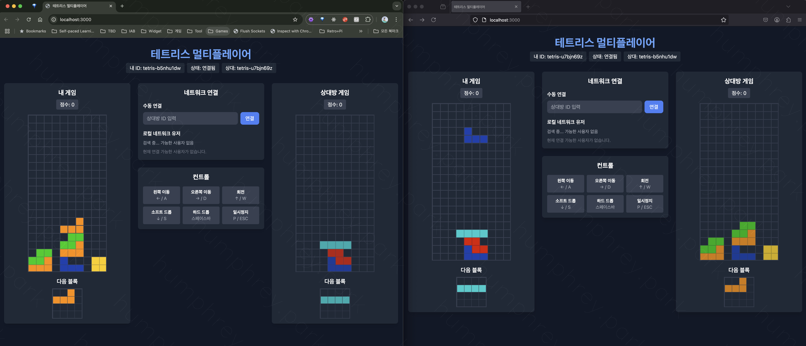

# tetris-multiplayer



## 생성 환경 및 프롬프트

Cursor + Claude-3.7-sonnet

```
네트워크로 실시간 대전 기능이 있는 테트리스 게임을 만들어주세요. 
HTML, Javscript, Tailwind CSS를 사용하며 다음 기능을 포함해야 합니다:

1. 기본 테트리스 게임 기능:
   - 7개 테트로미노 블록(I, J, L, O, S, T, Z)
   - 블록 회전, 좌우 이동, 소프트/하드 드롭
   - 줄 완성 시 제거 및 점수 획득
   - 다음 블록 미리보기
   - 게임 오버 처리

2. 네트워크 멀티플레이:
   - 아이디는 "tetris-"로 최초 자동발급 하고, 재발급되지 않게 local storage에 유지할 것
   - PeerJS 라이브러리를 사용한 P2P 연결
   - 호스트 모드와 참여 모드 지원
   - 유저가 없으면 싱글 플레이어 모드를 지원할 것
   - 싱글 플레이 게임 중에는 누군가 연결을 시도하면 자동 연결하고 새 게임을 시작할 것
   - 실시간으로 상대방 게임 보드, 다음 블럭, 점수 표시
   - 게임 상태 동기화 (블록 이동, 보드 업데이트, 점수, 게임 오버)
   - 동일 로컬 네트워크 사용자 자동 감지 및 매칭 기능
   - 연결시 바로 게임이 시작될 것
   - 서로 다른 브라우저 유저간에도 접근이 가능해야 함

3. UI 요구사항:
   - Tailwind CSS를 사용한 모던하고 반응형 디자인
   - 내 게임 영역과 상대방 게임 영역 분리
   - 점수, 다음 블록, 네트워크 상태 표시
   - 깔끔하고 직관적인 디자인
   - 모바일 브라우저에서도 연결 할 수 있는 반응형 UI

4. 기술 스택:
   - JavaScript(모듈 시스템 사용)
   - HTML5 Canvas API
   - Tailwind CSS
   - PeerJS 라이브러리(버전 1.5.2 이상)

5. 로컬 네트워크 매칭 기능:
   - PeerJS 컴포넌트를 활용하여 사용자 자동 감지
   - 브라우저 페이지 로드 시 자동으로 로컬 네트워크 내 다른 유저 자동 탐색
   - 동일 네트워크에서 대기 중인 사용자 목록 표시 및 원클릭 연결
   - 상대방 ID로 수동 연결할 수 있는 기능
   - 나 자신이 아닌 다른 사용자 목록을 보이게 할 것

6. 추가 요구사항:
   - 코드는 객체지향 패턴을 따를 것
   - 상태 관리를 명확하게 할 것
   - 에러 처리 및 네트워크 연결 문제 대응
   - 로깅을 통한 디버깅 용이성 확보
   - 브라우저 최적화 및 최신 웹 표준 준수

프로젝트 구조는 다음과 같이 구성해주세요:
1. index.html: 게임 화면 및 UI 요소 (Tailwind CSS 포함)
2. main.css: Tailwind 설정 및 추가 커스텀 스타일
3. tetris.js: 게임 로직 및 네트워크 코드
4. discovery.js: 로컬 네트워크 자동 매칭 로직
5. package.json: 의존성 관리 (Tailwind CSS, PeerJS 포함)
6. tailwind.config.js: Tailwind 구성 파일

코드는 상세한 주석을 포함하고, 확장 및 유지보수가 용이하도록 작성해주세요.
```

자세한건 [PROJECT_README.md](./PROJECT_README.md)를 참고하세요!
